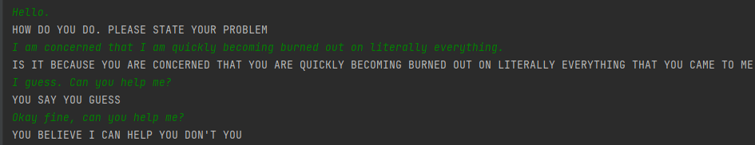

A python translation of anthay's C++ code. Find that here, and thank him because he did a lot more research than I did: https://github.com/anthay/ELIZA

## Requirements:
Built-ins are the only thing you need. Tested on python 3.7.

## Modules:
   - elizalogic       
     - responsible for storing the structures associated with eliza
   - elizascript      
     - responsible for loading eliza script 
   - elizaencoding        
     - utility related to the BCD encoding ELIZA originally used
   - eliza           
     - responsible for interpreting the script and generating a response
   - elizautil            
     - contains utility functions
   - elizatest       
     - Warning: contains unit tests
   - elizaconstant 
     - Fresh constants, ready to eat.
     
## Resources:
    - [DOCTOR_1966_01_CACM.py](DOCTOR_1966_01_CACM.py) - The original doctor script.
    - [cacm_1966_conversation.py](cacm_1966_conversation.py) - For testing purposes.
    - [cacm_1966_01_DOCTOR_TEST.py](cacm_1966_01_DOCTOR_TEST.py) - Comment stripped original script for testing purposes.
## Preview

